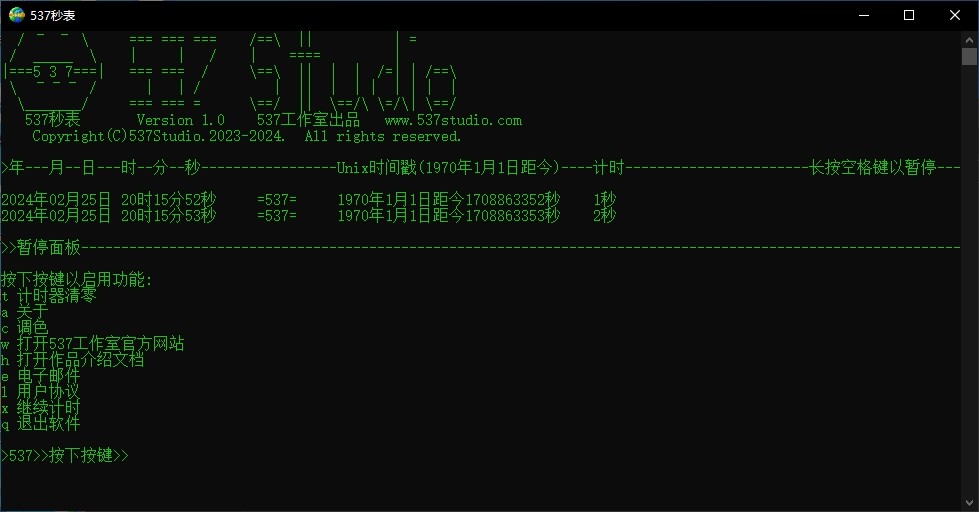
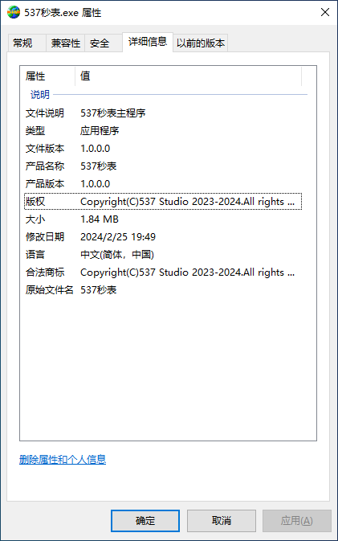

# 537 Clock 1.0

> For 64-bit portable version

## Table of Contents

- [Introduction](#introduction)
- [Download](#download)
- [Installation](#installation)
- [Help](#help)
- [Development](#development)

## Introduction

537 Clock is a Windows console application developed by 537 Studio, featuring a command-line interface with displays for year, month, day, hour, minute, second, Unix timestamp, stopwatch/reset, and color adjustment functions.

It is designed for convenient timing, time viewing, and Unix timestamp checking.



### Size

- 64-bit: 1.84MB
- 64-bit without any resource files: 66.4KB

### Release Date

- 64-bit: December 31st, 2023
- 64-bit without any resource files: January 17th, 2025

> The 32-bit version has not been released, but users can compile it themselves.

### Philosophy: Less is More

The design philosophy of the software is to **create an excellent user experience**. The software features icons built with characters and a user-friendly interface, allowing adjustment of the console foreground color (text color). Its interactive experience surpasses that of most command-line programs. For instance, while selecting menu functions, typical command-line programs require users to input text and press Enter. In contrast, 537 Clock cleverly employs a keyboard listening algorithm. When the software window is active, pressing a key on the keyboard will elicit an immediate response. This greatly facilitates the use of the software. For example, during the timing period, if the user long-presses the spacebar for about 1 second (long press to avoid accidental touches), the software will quickly open a pause panel with character animations, displaying functions such as reset and color adjustment. If the user then presses the corresponding function key (not a long press), the software will perform the related operation.

### Features

From the outset, 537 Clock was designed with **simplicity and efficiency** in mind. The following are the features and related introductions within the software:

#### **暂停面板（Pause Panel）**

During the operation of the software, **long-press the spacebar for about 1 second** to open the pause panel. The panel includes the following optional functions: Stopwatch Reset, About, Color Adjustment, Open 537 Studio Official Website, Open Product Introduction Document, Email, User Agreement, Continue Timing, Exit. Press the corresponding key in the first column of the window to execute the corresponding operation.

> After opening the pause panel, the ongoing timing operation will be paused.

#### **计时器清零（Stopwatch Reset**）

The software starts timing from the moment it is launched, with the timing duration displayed in seconds on the far right column of the window. Press the “ **t** ” key in the pause panel to reset the timing duration. After closing the reset panel, the timing will start again from 0, and this operation is irreversible.

#### **关于（About）**

Press the “ **a** ” key in the pause panel to display the software icon, version, and other related information. There will be a selection sound and a software startup sound during the display, along with comfortable character animations.

> For beta versions, 0.2 seconds after the character interface is displayed, the software will automatically pop up an about window, showing the current system information and software information. Click “Confirm” to close it. This window is a regular window type and can be retained without conflicting with the stopwatch's own functions. Even if this window is not closed, other operations can still be performed in the main window of the software.

#### **调色（Color Adjustment）**

Press the “c” key in the pause panel to execute this operation. This option provides the function to adjust the foreground color (text color) of the console window. Press the corresponding hexadecimal key (0-9, A-F) to select from the following colors:

| Key Code | Color | Key Code | Color |
| ---- | ---- | ---- | ---- |
| 0 | Black | 8 | Gray |
| 1 | Blue | 9 | Light Blue |
| 2 | Green | A | Light Green (Default) |
| 3 | Light Green | B | Very Light Green |
| 4 | Red | C | Light Red |
| 5 | Purple | D | Light Purple |
| 6 | Yellow | E | Light Yellow |
| 7 | White | F | Bright White |

> **Note**: The color descriptions are derived from the built-in command prompt program (cmd.exe) of the Microsoft Windows operating system. The actual display colors may not be the same as the described colors.
> 537 Clock does not store color data. After restarting, the text color will revert to light green.

#### **打开 537工作室 官方网站（Open 537 Studio Official Website）**

Press the “ **w** ” key in the pause panel to execute the operation of opening the [537 Studio Official Website](https://www.537studio.com). In the future, this website will launch the Web online help documentation for the “537 Clock” software. However, the relevant documentation is still incomplete at present. This is just a test function. If you encounter any issues accessing the link, please check the validity of the web address and try again.

#### **电子邮件（Email）**

Press the “ **e** ” key in the pause panel, and the program will call the system's default email sending software (such as email App, Outlook, etc.) and automatically create an email session with the recipient being the developer's email (<wushaoquan666@outlook.com>). The purpose of this email function is to allow users to contact the developer, send error messages, questions, etc., to obtain help and support.

#### **用户协议（User Agreement）**

Press the “ **l** ” key in the pause panel. This software uses the GNU GPL v3 open-source license, which will open the [open-source license webpage](https://www.gnu.org/licenses/lgpl-3.0-standalone.html). If you encounter any issues accessing the link, please check the validity of the web address and try again.

> According to the GPL v3 open-source license, this software has been open-sourced on the Gitee and GitHub platforms and allows anyone to modify and distribute it.

#### **继续计时（Continue Timing）**

If the user accidentally presses the spacebar or just wants to pause the timing, they can press the “ **x** ” key in the pause panel to return to the original timing state.

#### **退出（Exit）**

To exit the software, press the “ **q** ” key in the pause panel. After exiting, the timing duration and color settings will not be saved.

<!--

-->

## Download

- [537 Studio Official Website](https://www.537studio.com)
- [Gitee](https://gitee.com/FTS-537Studio/537Clock/releases/tag/v1.0)
- [GitHub](https://github.com/537Studio/537Clock/releases/tag/v1.0)

If you encounter any issues accessing the download links, please check the validity of the web addresses and try again.

## Installation

This software is a portable program. After downloading, it can be used immediately and can be moved around as a regular file.

### Compatibility Requirements

- 64-bit: Windows XP x64 Edition and Windows Server 2003 x64 (2005) and above 64-bit Windows operating systems
- 32-bit: WindowsXP Server Pack 1 x86 (2001) and above 32-bit and 64-bit Windows operating systems

## Help

### Frequently Asked Questions

#### Software Not Trusted

##### In the Browser

- Please expand the “More” option (if available) in the warning window and then select “Keep Anyway” or “Trust”.

##### In the System

- If the system pop-up shows “Unverified Publisher”, click “More Info” on the window and then select “Run Anyway”.
- If the antivirus software reports it as a virus, choose “Trust” or “Allow to Run”, or exit the antivirus software and try again.

#### Unable to Run

##### Shows “Unverified Publisher” or is Reported as a Virus by Antivirus Software

- Please refer to the section on Software Not Trusted.

##### Only a Blank Black Window Pops Up and There is No Response for a Long Time After Launching

- Please close the window and restart the software.

> Ensure that only one instance of the software is running. If multiple windows are displayed, close them one by one, leaving only one.

- If the computer does not respond after launching the software, please wait for a moment, or exit the antivirus software and try again.

#### Display Abnormality After Narrowing the Window

- This is a software bug, which has been fixed in version 1.1 and later updates.

#### Chinese Display is Garbled

##### Occurs in Operating Systems Other than Windows

- When running with Wine, try modifying the Wine console settings to display in ANSI encoding (or GBK and GB2312).
- Adjustments are also needed when using other software.

##### Occurs in Windows Environment

- Ensure that the system has correctly installed the Simplified Chinese language pack.

### Contact Us

- <hello@537studio.com>
- <wushaoquan666@outlook.com>

## Development

- Gitee：<https://gitee.com/FTS-537Studio/537Clock>
- GitHub：<https://github.com/Sean537/537Clock>

### Programming Language Used

- C++98

### Development Environment

#### Integrated Development Environment

- Editor: Dev-C++ 5.11
- Compiler: MinGW 4.9.2

#### Separate Compilation

1. Save the source code to your local machine.
2. Open the terminal and use the ```cd``` command to navigate to the current directory.
3. Compile it.

#### Windows

- Enter ```mingw32-make -f Makefile.win``` in the terminal and wait for the compilation to complete.

#### Linux

- Use the cross-compilation toolchain of make.

> Since the software uses Win32API, it can only be built in the Windows operating system environment. Alternatively, it can be cross-compiled in environments such as Linux.

4. After compilation, you can find “537 Clock.exe” in the current directory.

### Developers

· Sean537

> This document was last updated on **January 17, 2025**.
>
> Document author: Sean537
> 
> Copyright © 2023-2025 537 Studio
